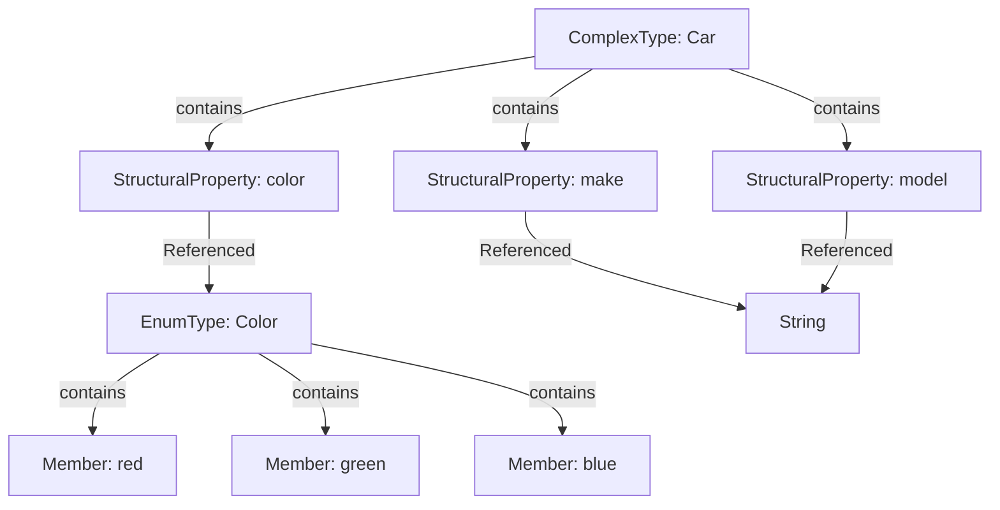

```mermaid
    graph

    Color["EnumType: Color"]
    red["Member: red"]
    green["Member: green"]
    blue["Member: blue"]
    Car["ComplexType: Car"]
    make["StructuralProperty: make"]
    model["StructuralProperty: model"]
    color["StructuralProperty: color"]
    Color--contains-->red
    Color--contains-->green
    Color--contains-->blue
    Car--contains-->make
    Car--contains-->model
    Car--contains-->color
    make--Referenced-->String
    model--Referenced-->String
    color--Referenced-->Color
```
