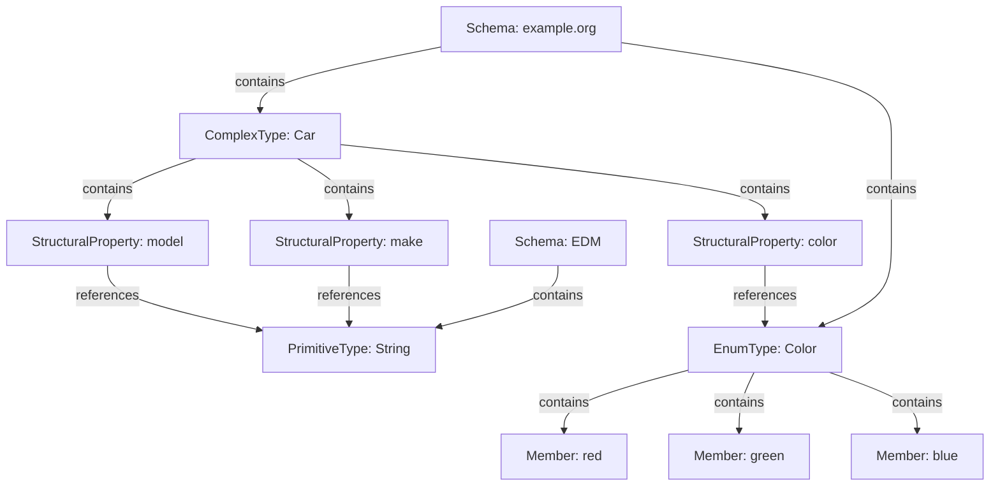

```mermaid
    graph

    EDM["Schema: EDM"]
    String["PrimitiveType: String"]
    example.org["Schema: example.org"]
    Color["EnumType: Color"]
    red["Member: red"]
    green["Member: green"]
    blue["Member: blue"]
    Car["ComplexType: Car"]
    make["StructuralProperty: make"]
    model["StructuralProperty: model"]
    color["StructuralProperty: color"]
    EDM--contains-->String
    example.org--contains-->Color
    example.org--contains-->Car
    Color--contains-->red
    Color--contains-->green
    Color--contains-->blue
    Car--contains-->make
    Car--contains-->model
    Car--contains-->color
    make--references-->String
    model--references-->String
    color--references-->Color
```
