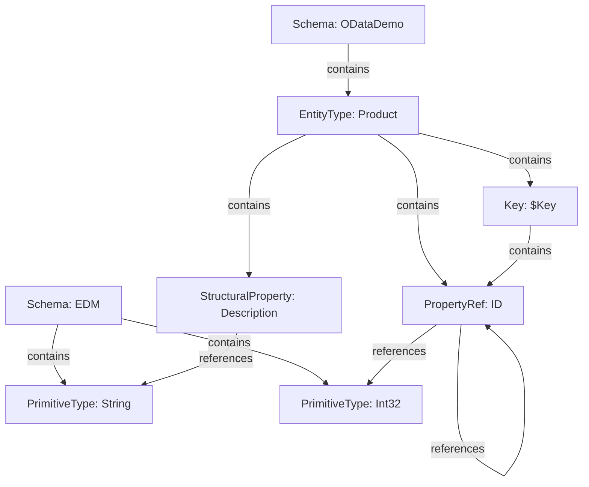

```mermaid
    graph

    EDM["Schema: EDM"]
    String["PrimitiveType: String"]
    Int32["PrimitiveType: Int32"]
    ODataDemo["Schema: ODataDemo"]
    Product["EntityType: Product"]
    ID["StructuralProperty: ID"]
    Description["StructuralProperty: Description"]
    $Key["Key: $Key"]
    ID["PropertyRef: ID"]
    EDM--contains-->String
    EDM--contains-->Int32
    ODataDemo--contains-->Product
    Product--contains-->ID
    Product--contains-->Description
    Product--contains-->$Key
    ID--references-->Int32
    Description--references-->String
    $Key--contains-->ID
    ID--references-->ID
```
