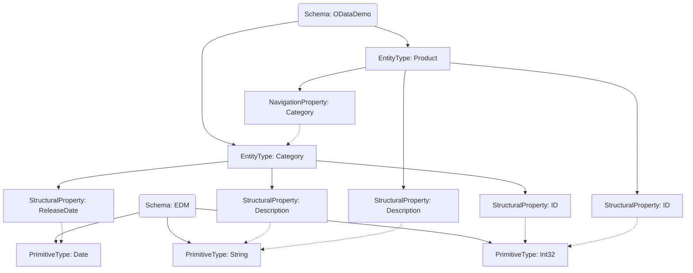

```mermaid
    graph

    n0("Schema: EDM")
    n1["PrimitiveType: Int32"]
    n2["PrimitiveType: String"]
    n3["PrimitiveType: Date"]
    n4("Schema: ODataDemo")
    n5["EntityType: Category"]
    n6["StructuralProperty: ID"]
    n7["StructuralProperty: Description"]
    n8["StructuralProperty: ReleaseDate"]
    n9["EntityType: Product"]
    n10["StructuralProperty: ID"]
    n11["StructuralProperty: Description"]
    n12["NavigationProperty: Category"]
    n0-->n1
    n0-->n2
    n0-->n3
    n4-->n5
    n4-->n9
    n5-->n6
    n5-->n7
    n5-->n8
    n6-.->n1
    n7-.->n2
    n8-.->n3
    n9-->n10
    n9-->n11
    n9-->n12
    n10-.->n1
    n11-.->n2
    n12-.->n5
```
