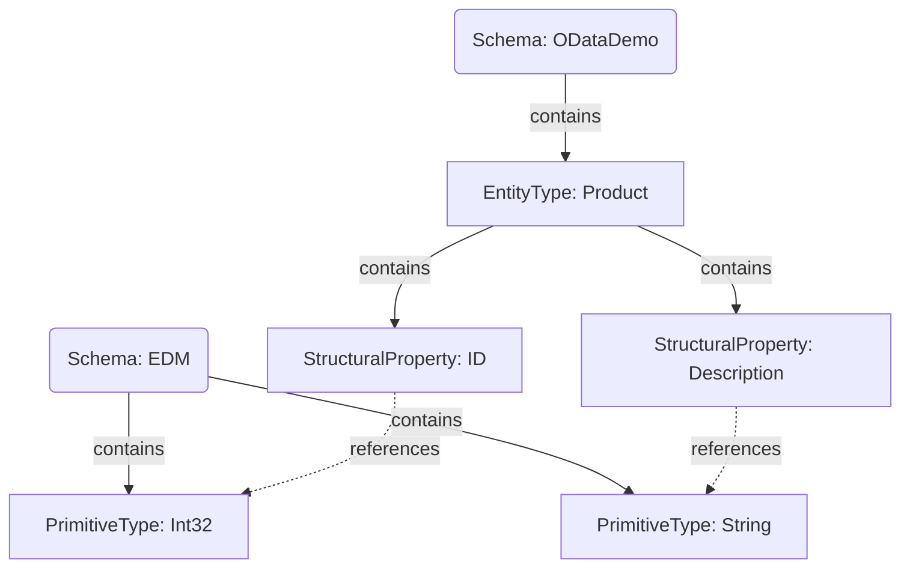

```mermaid
    graph

    n0("Schema: EDM")
    n1["PrimitiveType: String"]
    n2["PrimitiveType: Int32"]
    n3("Schema: ODataDemo")
    n4["EntityType: Product"]
    n5["StructuralProperty: ID"]
    n6["StructuralProperty: Description"]
    n0--contains-->n1
    n0--contains-->n2
    n3--contains-->n4
    n4--contains-->n5 
    n4--contains-->n6
    n5-.references.->n2
    n6-.references.->n1
```
