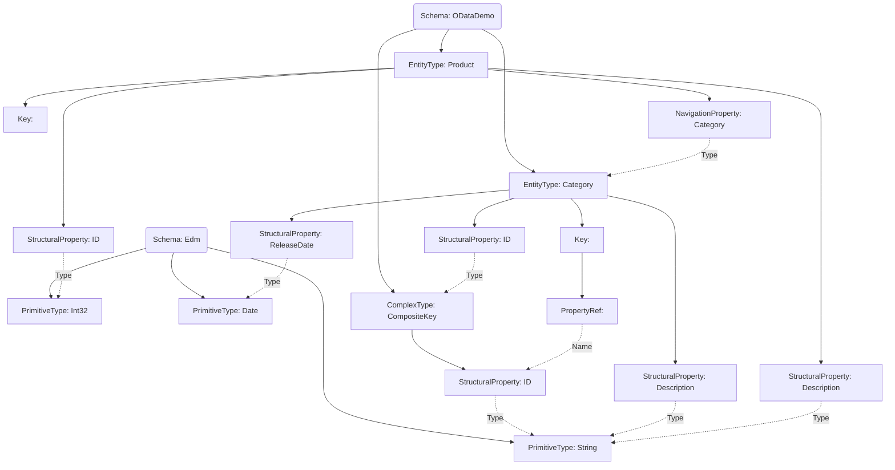

```mermaid
    graph

    n0("Schema: Edm")
    n1["PrimitiveType: Int32"]
    n2["PrimitiveType: String"]
    n3["PrimitiveType: Date"]
    n4("Schema: ODataDemo")
    n5["ComplexType: CompositeKey"]
    n6["StructuralProperty: ID"]
    n7["EntityType: Category"]
    n8["StructuralProperty: ID"]
    n9["StructuralProperty: Description"]
    n10["StructuralProperty: ReleaseDate"]
    n11["Key: "]
    n12["PropertyRef: "]
    n13["EntityType: Product"]
    n14["Key: "]
    n15["StructuralProperty: ID"]
    n16["StructuralProperty: Description"]
    n17["NavigationProperty: Category"]
    n0-->n1
    n0-->n2
    n0-->n3
    n4-->n5
    n4-->n7
    n4-->n13
    n5-->n6
    n6-.->|Type|n2
    n7-->n8
    n7-->n9
    n7-->n10
    n7-->n11
    n8-.->|Type|n5
    n9-.->|Type|n2
    n10-.->|Type|n3
    n11-->n12
    n12-.->|Name|n6
    n13-->n14
    n13-->n15
    n13-->n16
    n13-->n17
    n15-.->|Type|n1
    n16-.->|Type|n2
    n17-.->|Type|n7
```
