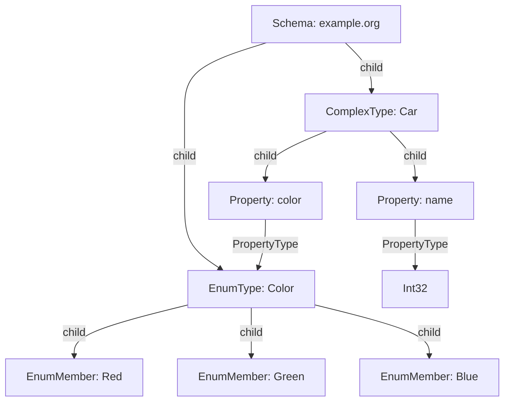

```mermaid
    graph

    example.org["Schema: example.org"]
    Color["EnumType: Color"]
    Red["EnumMember: Red"]
    Green["EnumMember: Green"]
    Blue["EnumMember: Blue"]
    Car["ComplexType: Car"]
    color["Property: color"]
    name["Property: name"]
    example.org--child-->Color
    example.org--child-->Car
    Color--child-->Red
    Color--child-->Green
    Color--child-->Blue
    Car--child-->color
    Car--child-->name
    color--PropertyType-->Color
    name--PropertyType-->Int32
```
