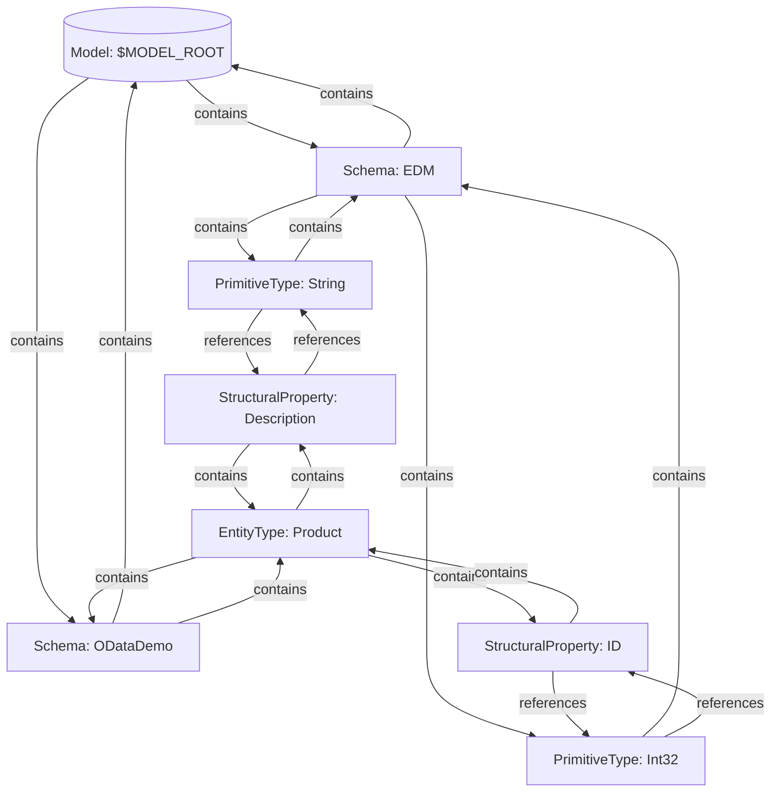

```mermaid
    graph

    n0[("Model: $MODEL_ROOT")]
    n1["Schema: EDM"]
    n2["PrimitiveType: String"]
    n3["PrimitiveType: Int32"]
    n4["Schema: ODataDemo"]
    n5["EntityType: Product"]
    n6["StructuralProperty: ID"]
    n7["StructuralProperty: Description"]
    n0--contains-->n1
    n0--contains-->n4
    n1--contains-->n0
    n1--contains-->n2
    n1--contains-->n3
    n2--contains-->n1
    n2--references-->n7
    n3--contains-->n1
    n3--references-->n6
    n4--contains-->n0
    n4--contains-->n5
    n5--contains-->n4
    n5--contains-->n6
    n5--contains-->n7
    n6--references-->n3
    n6--contains-->n5
    n7--references-->n2
    n7--contains-->n5
```
