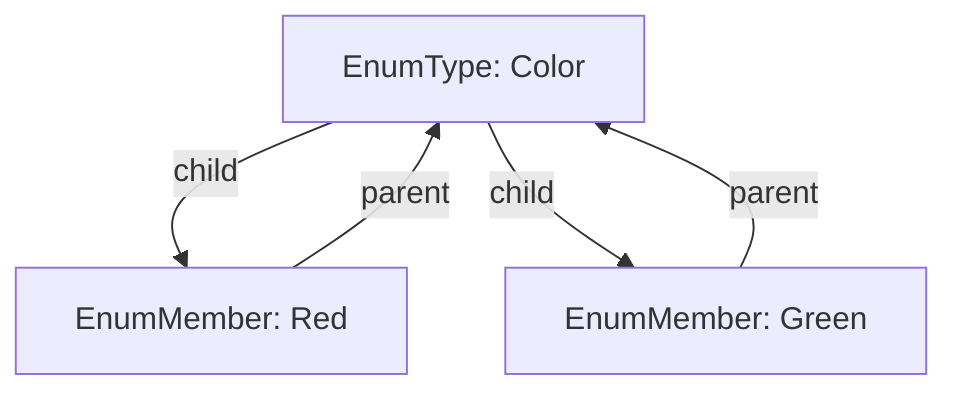

```mermaid
    graph

    Color[EnumType: Color]
    Red[EnumMember: Red]
    Green[EnumMember: Green]
    Color--child-->Red
    Color--child-->Green
    Red--parent-->Color
    Green--parent-->Color
```
